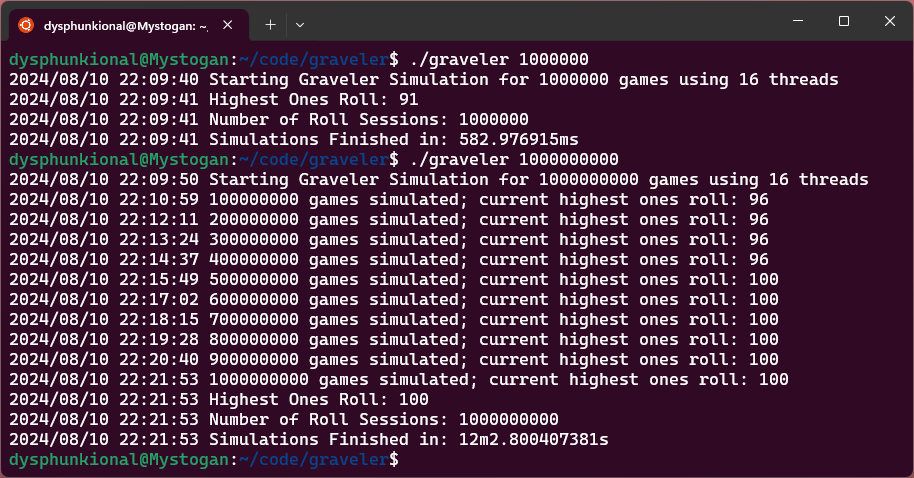

# Simulation of the Graveler Soft Lock

See [The Science Video](https://youtu.be/M8C8dHQE2Ro)

## Implementation details
- Using Go for the easy concurrency
- Accpets an optional command line parameter for the number of games to simulate



## Building

[Install Go](https://go.dev/doc/install)

Navigate to the directory that contains `go.mod` and `graveler.go`

```bash
go build
```

## Running

### Default of 1,000,000,000 runs

#### Linux/Mac
```bash
./graveler
```

#### Windows
```
graveler.exe
```

### Specifying 1,000,000 runs

#### Linux/Mac
```
./graveler 1000000
```

#### Windows
```
graveler.exe 1000000
```